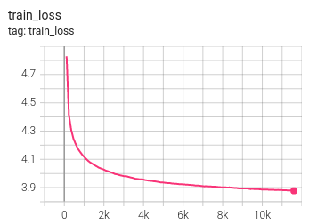
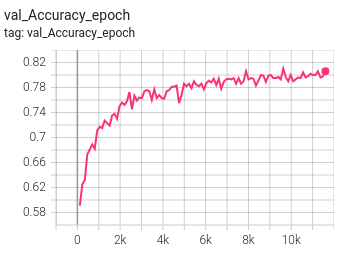
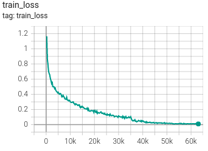
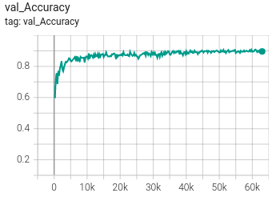

# ntropy-ml-enginner

### TASK 3

In most real-world applications, labelled data is scarce. Suppose you are given
the [Fashion-MNIST dataset](https://github.com/zalandoresearch/fashion-mnist), but without any labels
in the training set. The labels are held in a database, which you may query to
reveal the label of any particular image it contains. Your task is to build a classifier to
>90% accuracy on the test set, using the smallest number of queries to this
>database. 

You may use any combination of techniques you find suitable
(supervised, self-supervised, unsupervised). However, using other datasets or
pre-trained models is not allowed.

### Solution strategy
In order minimize the amount of labeled data, I have chosen to use an unsupervised ML model. The model, trained in an
unsupervised fashion, is then finetuned (in a supervised way) on labeled samples in order to reach >90% on the test set.

There is a lot of work on unsupervised methods in the literature, I have chosen to follow [this paper](https://arxiv.org/pdf/2010.04592.pdf) as I have some
previous experience on the topic (Hard Contrastive Learning) and there is code available from which we can start building
our solution.

The training dataset (60000 images) is split into:
* 55000 unlabeled images used for training
* 4000 labeled images used for training
* 1000 labeled images used for validation

### Requirements
* Python >=3.9 (previous versions might work but is not guaranteed)
* at least one GPU (the code run anyways without GPU, but it takes very long)

### Installation
Clone the repository
```bash
$ git clone git@github.com:giaco5988/ntropy-ml-engineer.git
```
Enter the repository, create a virtual environment and install required packages
```bash
$ cd ntropy-ml-engineer
$ python3.9 -m venv venv_ntropy
$ source venv_ntropy/bin/activate
(venv_ntropy) $ python
(venv_ntropy) $ pip install -r requirements.txt
```

### Training
First, let's run the unsupervised model (it takes ~10hours with 1 GPU)
```bash
(venv_ntropy) $ python main.py train_hcl
```
Second, let's finetune on the labeled data
```bash
(venv_ntropy) $ python main.py finetune pretrained_path=path/to/pretrained/model
```

NOTE: results are saved on `lightning_logs` folder.

### Results: test set accuracy 90% using 5000 labeled images

Below, see results for training loss and validation accuracy for the **unsupervised** model



Below, see results for training loss and validation accuracy for the **supervised** model



### Next Steps
* Train for longer time
* Add callbacks to plot inference on one batch during training
* Try different models for the base model
* Hyperparameter search, use different training and model parameters (e.g. lr, batch size, feature dimension)
* Add tests
* Add dvc-tracking to track data and pipelines
* In order to reduce queries to database, can we understand which are the most effective (optimal) labels to query?
E.g. those which are most difficult to classify. A first try could be to query those with low classification score.
This is similar to what is done in active learning.
